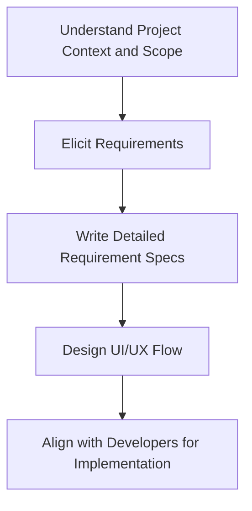

# Business Analyst Workflow: Best Practices Guide

## Workflow Overview


## Overview
This document outlines the essential workflow for Business Analysts, providing best practices and actionable guidance for each phase of the analysis process.

---

## 1. Understand Project Context, Objectives, and Scope

### Key Activities
- **Stakeholder Identification**: Map all primary and secondary stakeholders
- **Business Case Review**: Analyze the project's business justification and expected ROI
- **Scope Definition**: Clearly define what's included and excluded from the project
- **Success Criteria**: Establish measurable outcomes and acceptance criteria

### Best Practices
- **Document Everything**: Create a project charter or context document
- **Ask the Right Questions**:
  - What problem are we solving?
  - Who benefits from this solution?
  - What are the constraints (time, budget, resources)?
  - What does success look like?
- **Validate Understanding**: Confirm your interpretation with key stakeholders
- **Risk Assessment**: Identify potential risks and dependencies early

### Deliverables
- Project Context Document
- Stakeholder Analysis Matrix
- Scope Statement
- Risk Register (initial)

---

## 2. Elicit Requirements

### Key Activities
- **Stakeholder Interviews**: Conduct structured interviews with business users
- **Workshops and Brainstorming**: Facilitate collaborative requirement sessions
- **Process Analysis**: Document current state processes and identify gaps
- **Data Gathering**: Collect existing documentation, reports, and system information

### Best Practices
- **Use Multiple Techniques**:
  - Interviews (one-on-one and group)
  - Surveys and questionnaires
  - Document analysis
  - Observation and job shadowing
  - Prototyping and wireframing
- **Active Listening**: Focus on understanding the "why" behind requests
- **Ask Open-Ended Questions**: Encourage detailed responses
- **Document Assumptions**: Record and validate all assumptions
- **Prioritize Requirements**: Use techniques like MoSCoW (Must, Should, Could, Won't)

### Common Pitfalls to Avoid
- Don't assume you understand without validation
- Avoid leading questions that bias responses
- Don't skip difficult stakeholders
- Resist the urge to jump to solutions too quickly

### Deliverables
- Requirements Traceability Matrix
- Interview Notes and Summaries
- Process Flow Diagrams
- Stakeholder Requirements Document

---

## 3. Develop Detailed Requirements Specifications

### Key Activities
- **Requirements Documentation**: Create clear, testable, and unambiguous requirements
- **Acceptance Criteria Definition**: Specify conditions for requirement satisfaction
- **Requirements Validation**: Ensure requirements are complete and consistent
- **Traceability Management**: Link requirements to business objectives

### Best Practices
- **Use Standard Templates**: Maintain consistency across all requirements
- **Write SMART Requirements**:
  - **Specific**: Clear and unambiguous
  - **Measurable**: Quantifiable acceptance criteria
  - **Achievable**: Technically and practically feasible
  - **Relevant**: Aligned with business objectives
  - **Time-bound**: Include timing constraints
- **Requirements Structure**:
  ```
  REQ-ID: [Unique Identifier]
  Title: [Brief descriptive title]
  Description: [Detailed requirement description]
  Acceptance Criteria: [Specific conditions for acceptance]
  Priority: [High/Medium/Low or MoSCoW]
  Source: [Stakeholder or document source]
  Dependencies: [Related requirements or constraints]
  ```
- **Review and Validation**: Conduct formal reviews with stakeholders
- **Version Control**: Track changes and maintain requirement history

### Quality Checklist
- [ ] Requirements are testable
- [ ] No ambiguous language (avoid "user-friendly," "fast," "easy")
- [ ] Each requirement addresses a single need
- [ ] Requirements are feasible within constraints
- [ ] All stakeholder needs are addressed

### Deliverables
- Business Requirements Document (BRD)
- Functional Requirements Specification (FRS)
- Non-Functional Requirements Document
- Requirements Traceability Matrix (updated)

---

## 4. Design the UI/UX Flow

### Key Activities
- **User Journey Mapping**: Document end-to-end user experiences
- **Wireframe Creation**: Design low-fidelity interface layouts
- **Process Flow Design**: Create detailed workflow diagrams
- **Usability Considerations**: Ensure designs meet user needs and accessibility standards

### Best Practices
- **User-Centered Design**: Always design from the user's perspective
- **Start Simple**: Begin with low-fidelity wireframes before detailed designs
- **Collaborative Design**: Involve stakeholders in design sessions
- **Accessibility First**: Consider users with disabilities from the start
- **Mobile Responsiveness**: Design for multiple device types
- **Consistency**: Maintain design patterns across the application

### Design Tools and Techniques
- **Wireframing Tools**: Figma, Sketch, Balsamiq, or even paper sketches
- **User Story Mapping**: Organize features around user journeys
- **Prototype Testing**: Create clickable prototypes for validation
- **Design Systems**: Use consistent UI components and patterns

### Validation Methods
- **Stakeholder Reviews**: Present designs to business users
- **Usability Testing**: Test with actual users when possible
- **Accessibility Audits**: Ensure compliance with WCAG guidelines
- **Technical Feasibility**: Validate designs with development team

### Deliverables
- User Journey Maps
- Wireframes and Mockups
- UI/UX Specifications
- Prototype (if applicable)
- Design System Documentation

---

## 5. Work with Developers to Ensure Clear Implementation

### Key Activities
- **Requirements Handoff**: Present requirements and designs to development team
- **Technical Feasibility Review**: Validate requirements with technical constraints
- **Sprint Planning Support**: Help prioritize and estimate development work
- **Ongoing Collaboration**: Maintain communication throughout development

### Best Practices
- **Clear Communication**: Use developer-friendly language and documentation
- **Regular Check-ins**: Schedule frequent touchpoints during development
- **Be Available**: Respond quickly to clarification requests
- **Acceptance Testing**: Define and participate in testing activities
- **Change Management**: Handle requirement changes through proper channels

### Collaboration Techniques
- **Definition of Done**: Establish clear completion criteria
- **User Story Format**: Write requirements as user stories when appropriate
  ```
  As a [user type],
  I want [functionality],
  So that [business value].
  ```
- **Acceptance Criteria**: Provide specific, testable conditions
- **Demo Participation**: Attend sprint demos and provide feedback
- **Bug Triage**: Help prioritize and clarify defects

### Quality Assurance
- **Test Case Review**: Validate that test cases cover all requirements
- **User Acceptance Testing**: Coordinate UAT with business stakeholders
- **Documentation Updates**: Keep requirements current with implemented changes
- **Lessons Learned**: Capture insights for future projects

### Deliverables
- Technical Requirements Document
- User Stories with Acceptance Criteria
- Test Cases and Scenarios
- Implementation Guidelines
- Change Requests (as needed)

---

## Cross-Phase Best Practices

### Communication
- **Regular Updates**: Provide consistent project status communications
- **Stakeholder Management**: Keep all parties informed and engaged
- **Documentation**: Maintain clear, current, and accessible documentation
- **Feedback Loops**: Establish mechanisms for continuous feedback

### Tools and Templates
- **Requirements Management Tools**: Jira, Azure DevOps, or similar
- **Documentation Platforms**: Confluence, SharePoint, or wiki systems
- **Collaboration Tools**: Slack, Teams, or similar for communication
- **Version Control**: Maintain document versioning and change history

### Quality Assurance
- **Peer Reviews**: Have other BAs review your work
- **Stakeholder Sign-off**: Obtain formal approval at key milestones
- **Continuous Validation**: Regularly confirm requirements remain valid
- **Metrics Tracking**: Monitor project progress and requirement stability

---

## Success Metrics

### Project-Level Metrics
- Requirements stability (% of requirements that don't change)
- Stakeholder satisfaction scores
- On-time delivery of milestones
- Budget adherence

### Quality Metrics
- Defect rates related to requirements issues
- User acceptance test pass rates
- Post-implementation user satisfaction
- Business value realization

