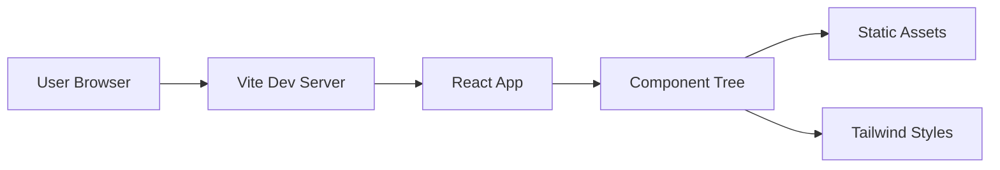
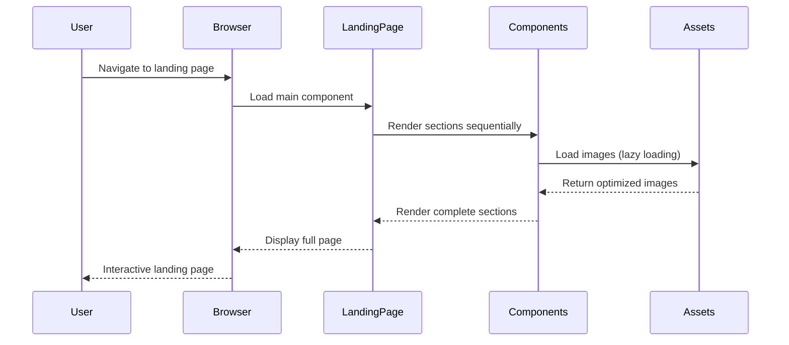
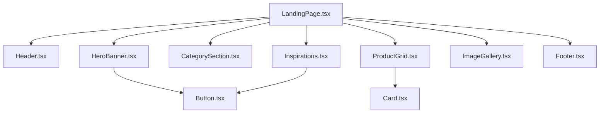
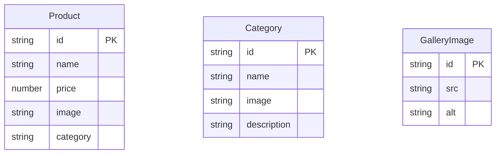
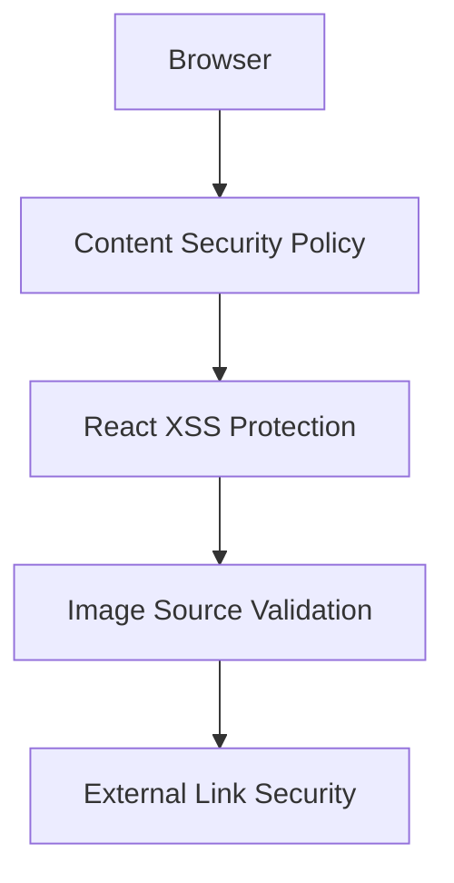
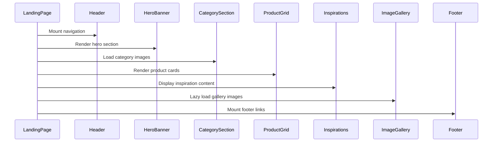

# 🏗️ Architecture: eCommerce Interior Design Landing Page

**Status**: 🟠 DRAFT  
**Last Updated**: 2025-06-28
**Author(s)**: huyenNguyen20

---

## 📚 Technical Summary

- Component-based React architecture for eCommerce interior design landing page
- Built using React, TypeScript, Vite, and Tailwind CSS
- Responsive design supporting desktop (1440px), tablet, and mobile viewports
- Modular component structure with reusable UI elements
- Optimized for performance with lazy loading and efficient asset management

---

## 🧰 Technology Stack

| Layer         | Technology         | Purpose              | Version/Notes            |
|---------------|--------------------|-----------------------|---------------------------|
| **Frontend**  | React              | UI Framework          | Latest Stable             |
|               | TypeScript         | Type Safety           | v5.x                      |
|               | Vite               | Build Tool            | Fast dev server + HMR     |
| **Styling**   | Tailwind CSS       | Utility-first CSS     | v3.x with responsive      |
|               | Google Fonts       | Typography            | Poppins font family       |
| **Assets**    | WebP/JPEG          | Image Optimization    | Compressed formats        |
| **Dev Tools** | ESLint             | Code Linting          | React + TypeScript rules  |
|               | Prettier           | Code Formatting       | Consistent styling        |

---

## 🌐 High-Level System Architecture



---

## 🧩 Core Business Flow: Landing Page Experience



---

## 🧱 Detailed Module Architecture



---

## 🗃️ Data Models



---

## 🔐 Security Architecture



* **XSS Prevention**: React's built-in protection, no `dangerouslySetInnerHTML`
* **Content Security Policy**: Implemented for production builds
* **Image Security**: Validated sources with error handling
* **External Links**: `rel="noopener noreferrer"` for security

---

## 🚀 Deployment Architecture

```mermaid
graph TD
  Development -->|npm run build| Vite[Vite Build]
  Vite -->|Static Assets| Dist[/dist folder]
  Dist --> CDN[Static Hosting]
  CDN --> Users[End Users]
```

### Environments

1. **Development** – Vite dev server with HMR
2. **Production** – Optimized static build with asset compression

---

## 🔁 CI/CD Pipeline

* **Build Steps**
  * TypeScript compilation → ESLint checks → Build optimization
* **Deployment**
  * Static assets generated in `/dist`
  * Ready for CDN or static hosting deployment

---

## 📈 Monitoring & Observability

### Performance Metrics

* Page load time (< 3 seconds)
* Image loading efficiency
* Bundle size optimization
* Responsive breakpoint performance

### Key Performance Indicators

* First Contentful Paint (FCP)
* Largest Contentful Paint (LCP)
* Cumulative Layout Shift (CLS)
* Time to Interactive (TTI)

---

## 📐 Development Guidelines

### Folder Structure

```plaintext
/src
├── components/
│   ├── layout/
│   │   ├── Header.tsx
│   │   └── Footer.tsx
│   ├── sections/
│   │   ├── HeroBanner.tsx
│   │   ├── CategorySection.tsx
│   │   ├── ProductGrid.tsx
│   │   ├── Inspirations.tsx
│   │   └── ImageGallery.tsx
│   └── ui/
│       ├── Button.tsx
│       └── Card.tsx
├── pages/
│   └── LandingPage.tsx
├── assets/
│   └── images/
├── types/
│   └── index.ts
└── styles/
    └── index.css
```

---

### Component Lifecycle



---

## 🧪 Testing Strategy

### Frameworks

| Type        | Tool                    |
| ----------- | ----------------------- |
| Unit Tests  | `Jest`, `React Testing Library` |
| E2E Tests   | `Playwright` or `Cypress` |
| Visual Tests| `Storybook` (optional)   |

### Test Structure

```plaintext
/src
├── components/
│   └── __tests__/
├── pages/
│   └── __tests__/
└── utils/
    └── __tests__/
```

### Testing Best Practices

1. **Component Tests**
   * Render testing for all components
   * Responsive behavior validation
   * User interaction testing

2. **Integration Tests**
   * Full page rendering
   * Cross-component communication
   * Image loading scenarios

3. **Visual Regression**
   * Screenshot comparison across breakpoints
   * Design system consistency

---

## 📱 Responsive Design Strategy

### Breakpoints

| Device    | Width     | Tailwind Class |
|-----------|-----------|----------------|
| Mobile    | < 768px   | `sm:`          |
| Tablet    | 768-1024px| `md:`          |
| Desktop   | 1024px+   | `lg:`          |
| Large     | 1440px+   | `xl:`          |

### Layout Patterns

* **Mobile-First**: Base styles for mobile, progressive enhancement
* **CSS Grid**: For complex layouts (ProductGrid, ImageGallery)
* **Flexbox**: For component-level layouts
* **Container Queries**: For component-specific responsive behavior

---

## 🎨 Design System

### Color Palette

```css
:root {
  --color-primary: #FFFFFF;
  --color-text: #333333;
  --color-accent: #FCF8F3;
}
```

### Typography Scale

* **Font Family**: Poppins (Google Fonts)
* **Headings**: 2xl, xl, lg weights
* **Body**: Base size with responsive scaling
* **Buttons**: Medium weight, proper contrast

---

## 📌 Appendix

### Component Props Interface

```typescript
// Core component interfaces
interface ProductProps {
  id: string;
  name: string;
  price: number;
  image: string;
  category: 'dining' | 'living';
}

interface CategoryProps {
  id: string;
  name: string;
  image: string;
  description: string;
}

interface ButtonProps {
  variant: 'primary' | 'secondary';
  size: 'sm' | 'md' | 'lg';
  children: React.ReactNode;
  onClick?: () => void;
}
```

### Performance Optimization Checklist

- [ ] Image lazy loading implemented
- [ ] WebP format for modern browsers
- [ ] Bundle size under 500KB
- [ ] Tree shaking enabled
- [ ] CSS purging in production
- [ ] Component code splitting