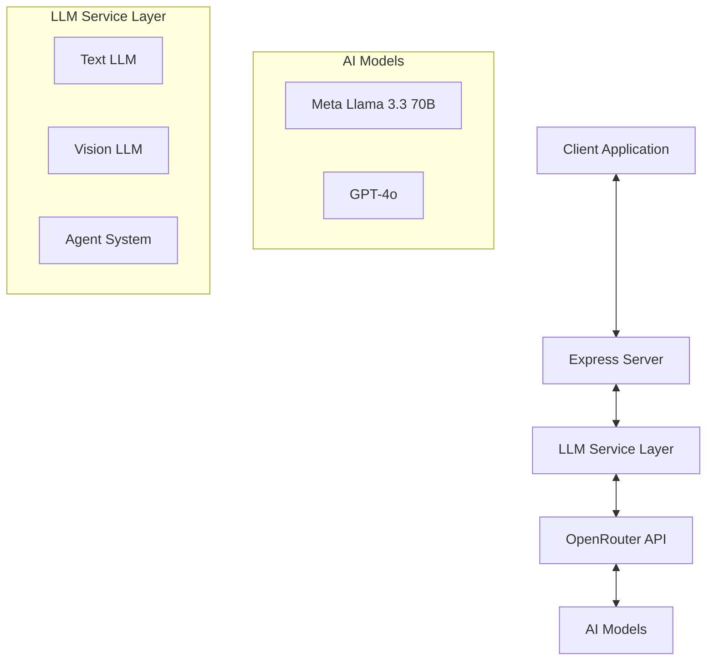
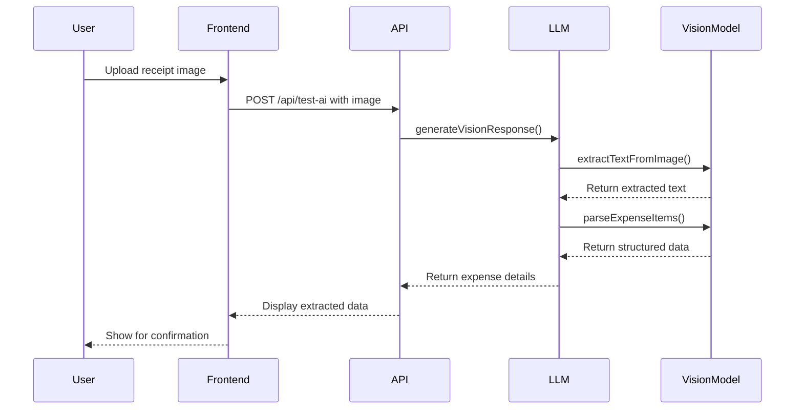
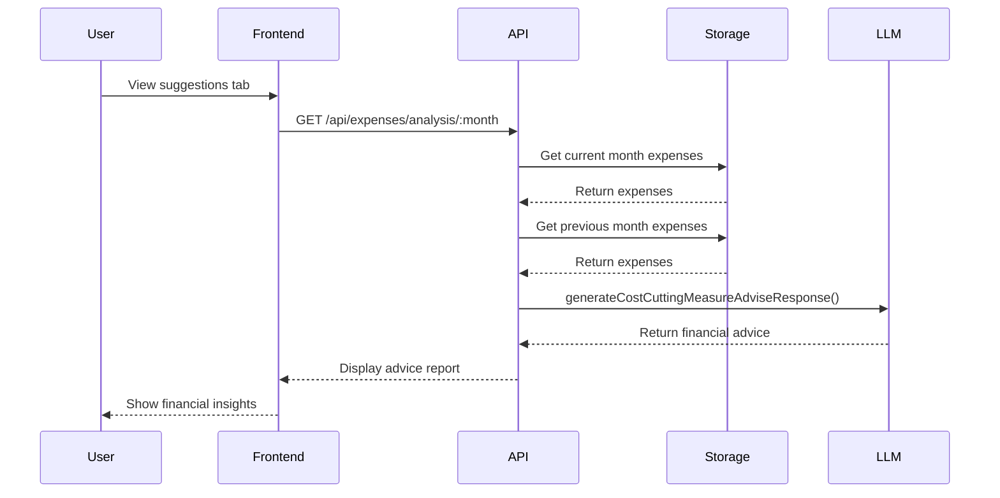
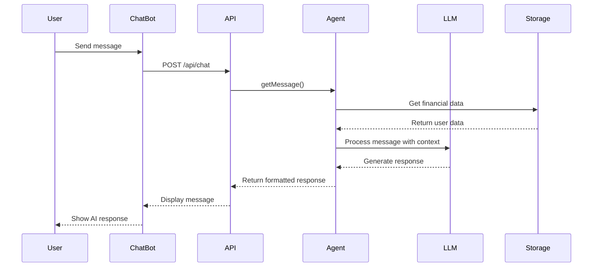

# AI Personal Finance Coach: AI Integration Guide

This guide explains how AI is integrated into the application, including the models used, data flows, and implementation details.

## AI Features Overview

The AI Personal Finance Coach uses several AI capabilities:

1. **Financial Analysis**: AI-powered analysis of spending patterns and budget utilization
2. **Receipt Processing**: Computer vision to extract expense details from receipt images
3. **Chat Assistant**: Conversational AI for personalized financial advice
4. **Weather Information**: Simple AI-generated weather data

## AI Architecture



## AI Models and Providers

The application uses OpenRouter as an API gateway to access various AI models:

1. **Text Processing**: Meta Llama 3.3 70B (Instruct)
   - Used for financial analysis, chat responses, and text processing
   - Configuration in `server/llm.ts` as `textLLM`

2. **Vision Processing**: OpenAI GPT-4o
   - Used for receipt image analysis
   - Configuration in `server/llm.ts` as `visionLLM`

## Key AI Components

### 1. LLM Service (`server/llm.ts`)

This file contains the core AI service implementations:

```typescript
// Text LLM configuration
export const textLLM = new ChatOpenAI({
  temperature: 0,
  topP: 0.7,
  maxTokens: 4000,
  modelName: "meta-llama/llama-3.3-70b-instruct",
  configuration: {
    baseURL: "https://openrouter.ai/api/v1",
    apiKey: process.env.OPENROUTER_API_KEY,
  },
});

// Vision LLM configuration
export const visionLLM = new ChatOpenAI({
  temperature: 0,
  topP: 0.7,
  maxTokens: 4000,
  modelName: "openai/gpt-4o",
  configuration: {
    baseURL: "https://openrouter.ai/api/v1",
    apiKey: process.env.OPENROUTER_API_KEY,
  },
});
```

### 2. Agent System (`server/agent.ts`)

The agent system manages conversational context and provides personalized responses:

- Initializes a LangChain agent with financial context
- Maintains conversation history in threads
- Processes user messages and generates responses

### 3. Financial Analysis

The `generateCostCuttingMeasureAdviseResponse` function in `server/llm.ts` analyzes expense data:

```typescript
export async function generateCostCuttingMeasureAdviseResponse(
  budgetExpenseDetailsThisMonth: ExpenseBudgetInformation,
  budgetExpenseDetailsLastMonth: ExpenseBudgetInformation
): Promise<{ financialAdviceReport: string, topSavingCategory: string, topSpendingCategory: string }>
```

This function:
1. Takes current and previous month expense data
2. Sends data to the AI model with specific prompts
3. Processes the response to extract financial advice
4. Returns a structured report with saving recommendations

### 4. Receipt Processing

The vision AI pipeline processes receipt images:

```typescript
export async function generateVisionResponse(
  base64Image: string,
  prompt?: string
): Promise<any> {
  // Extract text from image
  const extractedText = await extractTextFromImage(base64Image, prompt);
  
  // Parse expense items from text
  const parsedExpense = await parseExpenseItems(extractedText);
  
  return parsedExpense;
}
```

This process:
1. Takes a base64-encoded receipt image
2. Extracts text using the vision model
3. Parses the text to identify expense details (amount, category)
4. Returns structured expense data

## AI Data Flows

### 1. Receipt Processing Flow



### 2. Financial Analysis Flow



### 3. Chat Assistant Flow



## Prompt Engineering

The application uses carefully crafted prompts to guide the AI models:

### 1. Financial Analysis Prompt

```
You are a financial consultant. Your task is to provide clients with some 
effective cost cutting measures for their monthly expense. You will be given 
detailed information about EXPENSE BUDGET INFORMATION of the current month 
and previous month.

OUTPUT REQUIREMENTS: 
DO NOT make up false information.
Give assessment about their current financial situations, detailed advices about 
cost cutting measures only and make a comparison of the current and previous month, 
in markdown format. Using proper headings, sections, table, bullets to clarify your answer.
```

### 2. Receipt Analysis Prompt

```
Identify and extract the following information from the given image:

1. **Amount (if any)** (as a number)
2. **Currency (if any)** (such as "vnd", "usd", "eur", lowercase)
3. **Description (if any)** (such as "buying food", "buying bus ticket", "buying utility")
---
### Rules:
- Do NOT include explanations or additional text.
- Do NOT make up false information
```

## Response Processing

AI responses are processed to ensure they match expected formats:

1. **JSON Parsing**: The `reformatJsonResponse` function handles malformed JSON responses
2. **Structured Data**: Responses are parsed into TypeScript interfaces
3. **Error Handling**: Failed AI requests are gracefully handled with fallbacks

## Adding New AI Features

To add a new AI feature:

1. Define the feature requirements and expected inputs/outputs
2. Create a new function in `server/llm.ts` that:
   - Takes structured input data
   - Constructs an appropriate prompt
   - Calls the appropriate LLM model
   - Processes and validates the response
3. Add an API endpoint in `server/routes.ts`
4. Implement the UI component to interact with the new feature

## Best Practices

1. **Prompt Engineering**:
   - Be specific about the expected output format
   - Provide clear instructions and constraints
   - Use system and user message roles appropriately

2. **Error Handling**:
   - Always handle potential AI failures gracefully
   - Provide fallback responses when AI services are unavailable
   - Validate AI responses before using them

3. **Performance Optimization**:
   - Use appropriate token limits to balance detail and cost
   - Cache responses when appropriate
   - Use streaming for long responses when possible

4. **Security Considerations**:
   - Never expose API keys in client-side code
   - Validate and sanitize all user inputs before sending to AI
   - Implement rate limiting for AI-powered endpoints

## Testing AI Features

1. **Mock Responses**: Use Jest mocks to simulate AI responses in tests
2. **Test Edge Cases**: Test with various inputs including edge cases
3. **Response Validation**: Verify that responses are properly validated and processed

## Future AI Enhancements

1. **Predictive Analysis**: Forecast future spending based on historical patterns
2. **Personalized Recommendations**: More tailored financial advice based on user behavior
3. **Multi-modal Interactions**: Support for voice input/output
4. **Advanced Receipt Processing**: Extract more detailed information from receipts
5. **Anomaly Detection**: Identify unusual spending patterns