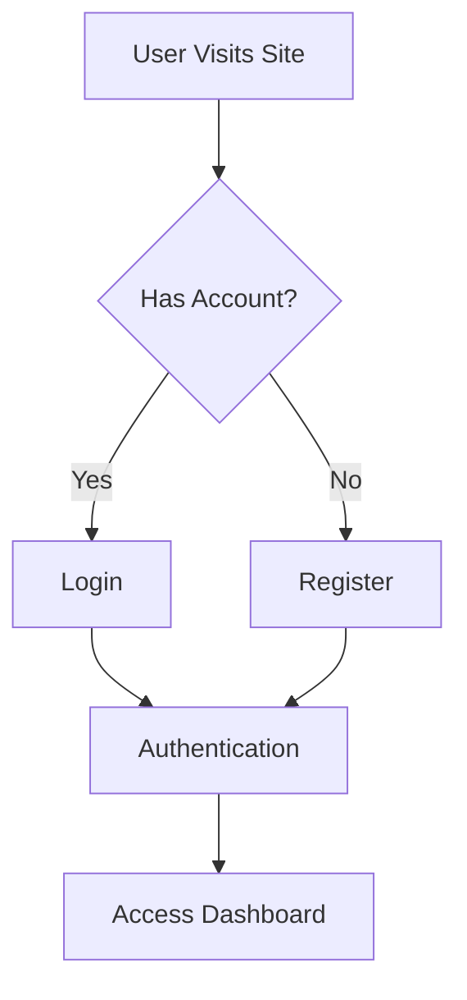
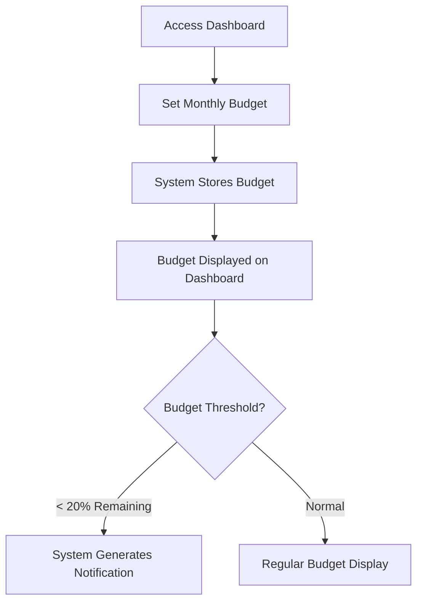
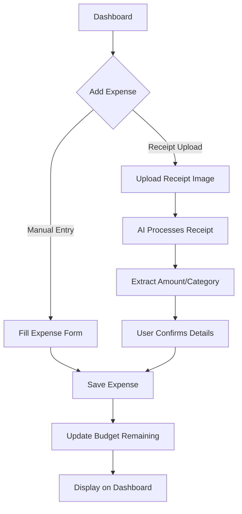
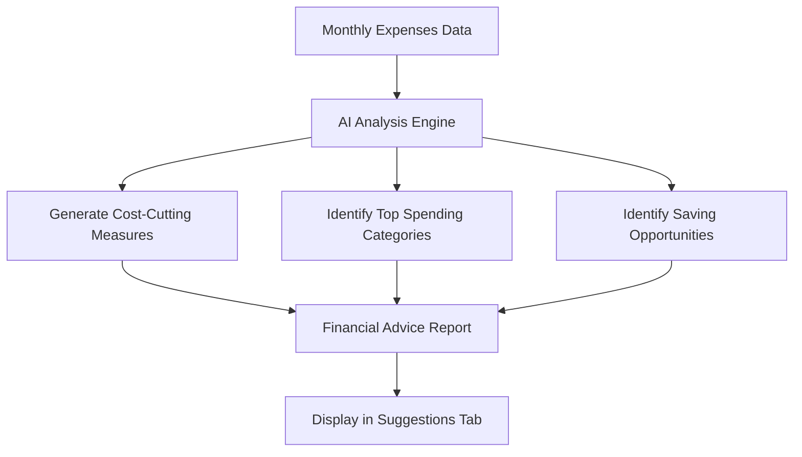
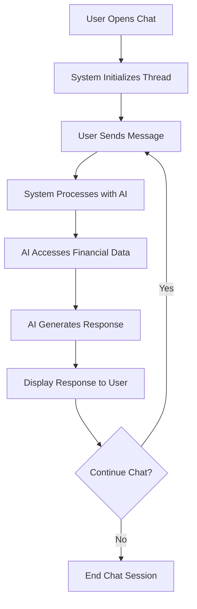

# AI Personal Finance Coach: Business Process Documentation

## Overview

The AI Personal Finance Coach is an application designed to help users manage their personal finances through AI-powered insights, expense tracking, and personalized financial advice. This document outlines the key business processes and user journeys within the application.

## Core Business Processes

### 1. User Authentication Flow

1. User visits the application
2. User either logs in with existing credentials or registers a new account
3. Upon successful authentication, user is redirected to the dashboard

### 2. Budget Management Process

1. User sets a monthly budget amount
2. System stores the budget information
3. Budget information is displayed on the dashboard
4. System monitors budget usage
5. When remaining budget falls below 20%, system generates a notification

### 3. Expense Tracking Process

1. User adds an expense through either manual entry or receipt upload
2. For receipt uploads, AI processes the image to extract expense details
3. User confirms or adjusts the extracted information
4. System saves the expense and updates the remaining budget
5. Expense is displayed in the dashboard's expense list and charts

### 4. AI Financial Analysis Process

1. System collects user's expense data for current and previous months
2. AI analyzes spending patterns and budget utilization
3. System generates personalized financial advice including:
   - Cost-cutting measures
   - Top spending categories
   - Saving opportunities
4. Financial advice is displayed in the Suggestions tab

### 5. AI Chat Assistant Process

1. User opens the chat assistant
2. System initializes a chat thread
3. User sends a message requesting financial advice
4. System processes the message using AI
5. AI accesses the user's financial data to provide personalized responses
6. System displays the AI response to the user
7. Chat continues until user closes the chat window

## Key Business Rules

1. **Budget Threshold Alert**: Notification is triggered when remaining budget falls below 20% of total budget
2. **Expense Categorization**: All expenses must be categorized as Food, Transportation, Housing, Entertainment, or Other
3. **Financial Data Privacy**: User financial data is only accessible to the authenticated user
4. **AI Analysis Timing**: Financial analysis is performed on a monthly basis comparing current month to previous month

## User Personas

### 1. Budget-Conscious Individual
- **Goals**: Track daily expenses, stay within budget
- **Key Features Used**: Budget setting, expense tracking, notifications

### 2. Financial Planning Enthusiast
- **Goals**: Optimize spending, find saving opportunities
- **Key Features Used**: AI analysis, suggestions, expense charts

### 3. Financial Novice
- **Goals**: Learn better financial habits, get personalized advice
- **Key Features Used**: AI chat assistant, financial advice reports

## Business Metrics

1. **Budget Adherence Rate**: Percentage of users staying within their set budgets
2. **Expense Reduction**: Month-over-month reduction in user spending in key categories
3. **Feature Engagement**: Usage rates of AI chat assistant and financial analysis features
4. **User Retention**: Continued active usage of the application over time

## Future Business Capabilities

1. **Investment Recommendations**: AI-powered investment suggestions based on saving patterns
2. **Financial Goal Setting**: Allow users to set and track progress toward financial goals
3. **Bill Payment Reminders**: Automated reminders for recurring expenses
4. **Multi-Currency Support**: Support for tracking expenses in multiple currencies